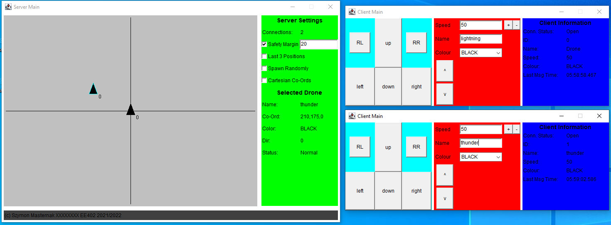

# DCU EE402 Assignment 2

Repository for the Java drone client/server assignment 2020/2021.

## How to Run?
First Run the Server:

    java ServerMain

Then run the client:

    java ClientMain localhost RobotName

## Images

